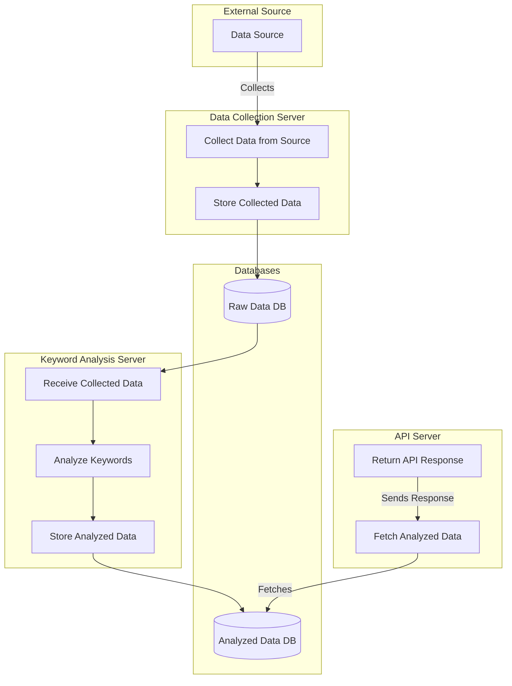

# 키워드 분석 서비스

## 개요

**키워드 분석 서비스**는 문서 내에서 중요한 키워드를 추출하는 서비스입니다.

Apache OpenNLP와 TF-IDF 알고리즘을 사용해 문서의 핵심 명사를 식별하고, 빈도를 기반으로 중요한 키워드를 분석합니다.

이 프로젝트에서는 **TDD**를 적용해 테스트 코드의 중복을 최소화하고, 코드 품질을 개선하였습니다.

**TF-IDF를 사용한 키워드 추출**: 문서에서 명사를 추출하고 TF-IDF 알고리즘을 통해 핵심 키워드를 선정합니다.

**TDD(Test Driven Development)**: 테스트 주도 개발 방식을 적용하여 기능 구현 전 테스트 케이스를 작성하였고, 테스트 코드의 중복을 최소화하기 위해 추상 클래스로 리팩토링하였습니다.

## 프로젝트 구조

이 프로젝트는 세 개의 주요 서버로 구성되어 있습니다:

1. 데이터 수집 서버: 외부 소스로부터 주기적으로 데이터를 수집합니다.
2. 키워드 분석 서버: 수집된 데이터를 처리하고 키워드를 분석합니다.
3. API 서버: 분석된 키워드 데이터를 조회할 수 있는 API를 제공합니다.

모든 서버는 공유 데이터베이스를 사용하여 데이터를 저장합니다.

### Flow Chart



### 디렉터리 구조

```
data-collector/
analysis-api/
keyword-analyzer/
├── src/
│   ├── main/
│   │   ├── java/
│   │   │   └── com/example/keyword-analyzer/
│   │   │       ├── KeywordAnalyzerApplication.java
│   │   │       ├── controller/             # 컨트롤러 계층
│   │   │       ├── service/                # 서비스 계층 (비즈니스 로직)
│   │   │       ├── repository/             # 레포지터리 계층 (데이터베이스 엑세스)
│   │   │       ├── model/                  # 모델 계층 (데이터 구조)
│   │   │       ├── config/                 # 설정 파일
│   │   │       └── util/                   # 유틸리티 클래스
│   │   └── resources/
│   │       ├── application.properties
│   │       ├── static/                     # 정적 리소스
│   │       └── templates/                  # 템플릿 파일
│   └── test/
│       ├── java/
│       │   └── com/example/keyword-analyzer/
│       │       ├── config/                   # 환경 및 설정 관련 테스트
│       │       ├── controller/               # 컨트롤러 레이어 테스트
│       │       ├── repository/               # 데이터베이스 레이어(JPA/MyBatis) 테스트
│       │       ├── service/                  # 서비스 레이어 테스트
│       │       ├── integration/              # 통합 테스트
│       │       ├── unit/                     # 단위 테스트
│       │       ├── utils/                    # 유틸리티 클래스 테스트
│       │       ├── learning/                 # 학습 테스트
│       │       └── KeywordAnalyzerApplicationTests.java
│       └── resources/
├── build.gradle
└── README.md
```

## 기술 스택

- Java 17
- Spring Boot 3.3.3
- Apache OpenNLP: 자연어 처리 라이브러리
- TF-IDF 알고리즘: 키워드 중요도 계산
- JUnit: 테스트 라이브러리

## 키워드 추출 프로세스

1. **명사 추출**

   Apache OpenNLP를 사용하여 입력된 문서에서 명사를 추출합니다.

   텍스트를 토큰화한 후, 품사 태깅을 통해 명사를 분류합니다.

2. **TF-IDF 알고리즘**

   명사 추출이 완료되면, TF-IDF 알고리즘을 적용하여 단어의 빈도와 중요도를 계산하여 핵심 용어를 추출합니다.

3. **분석 결과 저장**

   분석한 핵심 용어를 DB에 저장합니다.

4. **API 엔드포인트**

   특정 문서들의 추출된 키워드와 TF-IDF 점수를 반환합니다.

## 개발 과정

### 1. TF-IDF 알고리즘으로 키워드 추출

TF-IDF(Term Frequency-Inverse Document Frequency) 알고리즘은 문서에서 중요한 키워드를 추출하는 데 사용됩니다.

이 알고리즘은 특정 단어가 문서 내에서 얼마나 자주 등장하는지(TF)와 해당 단어가 전체 문서 집합에서 얼마나 드물게 등장하는지(IDF)를 결합하여 단어의 중요도를 계산합니다.

문서에서 단어에 대한 관심사를 TF로 표현하고, "이것", "그것" 등과 같이 주제에 관련 없이 모든 문서에 자주 등장하는 단어를 IDF로 배제하여 중요한 키워드를 분석합니다.

**TF 값**


```math 
tf_t,_d =
\begin{cases}
1+\log_{10}count(t,d) & count(t,d)>0,\\
0
\end{cases}
```


- count(t,d): 문서 d에서 단어 t가 등장한 횟수

**IDF 값**

```math
idf_t = \log_{10}(N/N_t)
```

- N: 전체 문서 개수
- N_t: 단어 t가 등장한 문서 개수

**TF-IDF 가중치 값**

```math
w_t,_d = tf_t,_d * idf_t
```

### 2. 추상 클래스를 이용한 리팩토링

테스트 코드의 중복을 줄이기 위해 공통적으로 사용되는 코드를 **추상 클래스(AbstractTest)**로 리팩토링하였습니다.

각 테스트 클래스는 이 추상 클래스를 상속받아 유지보수성을 높였습니다.

예시: Repository 테스트 코드에서 공통적으로 테스트하는 로직은 추상 클래스에서 구현

Repository들은 공통적으로 저장, 조회, 삭제 테스트를 할 것으로 예상하여, 추상 클래스에 저장, 조회, 삭제 테스트 로직을 구현한다.

Repository 테스트들은 모두 이 클래스를 상속하여 저장, 조회, 삭제 테스트를 중복적으로 작성하지 않아도 된다.

```java

@SpringBootTest
public abstract class BasicRepositoryTest<T> {
	protected JpaRepository<T, Long> repository;

	public BasicRepositoryTest(JpaRepository<T, Long> repository) {
		this.repository = repository;
	}

	protected abstract Long getId(T entity);

	protected abstract T createMockData();

	protected abstract void assertDataEquals(T expected, T actual);

	@Test
	void repositoryLoads() {
		// 레포지터리 연동 테스트
	}

	@Test
	void saveEntity() {
		// 엔티티 저장 테스트
	}

	@Test
	void findEntity() {
		// 엔티티 조회 테스트
	}

	@Test
	void deleteEntity() {
		// 엔티티 삭제 테스트
	}
}
```
