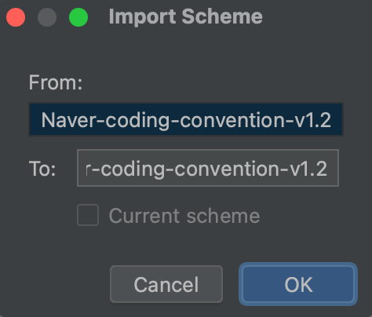

# 키워드 분석 서비스

## Intellij 자동 포맷팅 설정

### 1. formatter 다운로드

포맷터 파일을 .xml 확장자로 다운로드

[네이버 formatter 링크](https://github.com/naver/hackday-conventions-java/tree/master/rule-config)

- **naver-intelij-formatter.xml** 다운로드

### **2. Settings > Editor > Code Style**

### 3. 톱니바퀴 아이콘 > Import Scheme > IntelliJ IDEA code style XML

### 4. 다운로드 받은 XML 파일 선택

### **5. 자동 포맷팅 설정**

**Settings > Tools > Actions on Save**

- Reformat code 체크 : 저장할 때마다 자동으로 코드 포맷팅
- Optimize imports 체크 : class에서 사용하지 않는 import를 자동으로 제거

### **6. checkStyle 적용 (Optional)**

**Settings > Plugins > CheckStyle-IDEA 검색 후 설치**
→ 설치 후 재시작 필요

재시작을 하고나면 아래 이미지처럼 Tools 하위에 Checkstyle 탭이 생성되어있을겁니다.

### 7. Settings > Tools > Checkstyle > rules.xml 파일을 추가 > next

- Treat Checkstyle errors as warnings

  코드에 포맷에 맞지 않은 스타일이 있을 경우, IDE에서 warnings 표시

- naver-checkstyle-rules.xml 추가

### 8. suppressions.xml를 입력

naver-checkstyle-suppressions.xml를 입력

### 9. Next > Finish

### **10. 플러그인 테스트**

View > Tool Windows > CheckStyle 탭
IDE 하단 CheckStyle > Scan에서 코딩컨벤션 오류를 확인

